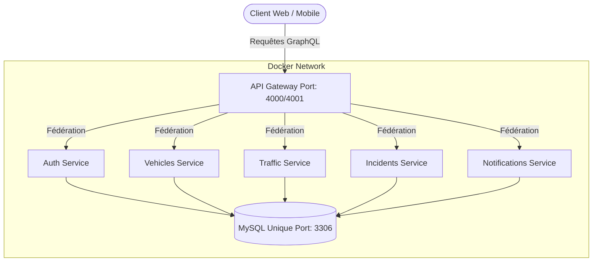
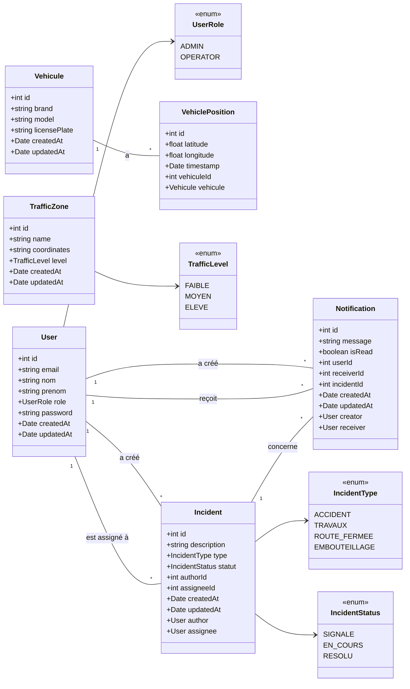

# Projet Microservices de Gestion de Trafic Urbain

Ce projet implémente une architecture de microservices pour la gestion du trafic urbain, des incidents, des notifications et de l'authentification des utilisateurs. Il utilise NestJS pour les microservices, GraphQL avec Apollo Federation pour l'API Gateway, et Docker Compose pour l'orchestration des conteneurs.

## 🔗 Lien du Projet
**GitHub :** [https://github.com/mouinmohsni/mini_projet_microservices.git](https://github.com/mouinmohsni/mini_projet_microservices.git)

---

## 1. Architecture

L'architecture est basée sur des microservices communiquant via GraphQL et orchestrés par Docker Compose. L'API Gateway, utilisant Apollo Federation, agrège les schémas GraphQL de chaque microservice, offrant un point d'entrée unique et unifié pour les clients.

### Diagramme d'Architecture (Déploiement)



### Diagramme de Classes (Entités principales)



## 2. Services

Le projet est composé des microservices suivants :

- **Auth Service** : Gère l'authentification des utilisateurs (enregistrement, connexion) et l'émission de tokens JWT.
- **Vehicles Service** : Gère les informations sur les véhicules et leurs positions.
- **Traffic Service** : Gère les zones de trafic et leur niveau de congestion.
- **Incidents Service** : Gère la création, la consultation, la mise à jour et la suppression des incidents. Permet d'assigner un incident à un opérateur.
- **Notifications Service** : Gère l'envoi et la consultation des notifications pour les utilisateurs, avec traçabilité de l'expéditeur et du destinataire.
- **API Gateway** : Point d'entrée unique pour toutes les requêtes GraphQL, utilisant Apollo Federation pour agréger les schémas des microservices.

## 3. Installation et Lancement (Docker Compose)

Assurez-vous d'avoir Docker Desktop installé et en cours d'exécution.

1. **Cloner le dépôt :**
   ```bash
   git clone https://github.com/mouinmohsni/mini_projet_microservices.git
   cd mini_projet_microservices
   ```

2. **Lancer les services (Version 1 - `docker-compose.yml`) :**
   ```bash
   docker-compose up --build -d
   ```
   *Les services seront accessibles sur les ports par défaut (API Gateway sur `http://localhost:4000/graphql`).*

3. **Lancer les services (Version 2 - `docker-compose-v2.yml`) :**
   Si vous avez une deuxième configuration Docker (par exemple, pour le développement de nouvelles fonctionnalités sans impacter la version stable), utilisez :
   ```bash
   docker-compose -f docker-compose-v2.yml up --build -d
   ```
   *Les services seront accessibles sur les ports décalés (API Gateway sur `http://localhost:4001/graphql`).*

4. **Arrêter les services :**
   ```bash
   docker-compose down -v
   # Ou pour la V2 :
   docker-compose -f docker-compose-v2.yml down -v
   ```
   *L'option `-v` supprime également les volumes de données, utile pour un redémarrage propre de la base de données.*

## 4. Requêtes GraphQL de Test (Apollo Studio / Postman)

Accédez à l'API Gateway via votre navigateur à `http://localhost:4000/graphql` (ou `http://localhost:4001/graphql` pour la V2) pour utiliser Apollo Studio, ou configurez Postman.

**N'oubliez pas de placer le token JWT dans les en-têtes HTTP :**
`Authorization: Bearer VOTRE_TOKEN_JWT`

### Scénario de Démonstration

**1. Enregistrement d'un utilisateur (Admin ou Opérateur)**
```graphql
mutation {
  register(registerInput: {
    email: "admin@example.com",
    password: "password123",
    nom: "Dupont",
    prenom: "Jean",
    role: ADMIN # Ou OPERATOR
  }) {
    id
    email
    role
  }
}
```

**2. Connexion d'un utilisateur (Admin)**
```graphql
mutation {
  login(loginInput: {
    email: "admin@example.com",
    password: "password123"
  }) {
    access_token
    user { id email role }
  }
}
```
*(👉 Copiez le `access_token` et utilisez-le pour les requêtes suivantes.)*

**3. L'Admin crée un incident et l'assigne à un Opérateur (ID 2)**
```graphql
# Création de l'incident
mutation {
  createIncident(createIncidentInput: {
    description: "Gros embouteillage sur l'avenue principale",
    type: EMBOUTEILLAGE,
    assigneeId: 2 # ID de l'opérateur
  }) {
    id
    description
    type
    statut
    assigneeId
  }
}

# L'Admin envoie une notification à l'Opérateur assigné
mutation {
  createNotification(createNotificationInput: {
    message: "URGENT: Nouvel incident #1 assigné. Veuillez traiter.",
    receiverId: 2, # ID de l'opérateur
    incidentId: 1 # ID de l'incident créé
  }) {
    id
    message
    receiverId
    incidentId
  }
}
```

**4. L'Opérateur consulte ses notifications (après s'être connecté et avoir récupéré son token)**
```graphql
query {
  myNotifications {
    id
    message
    isRead
    createdAt
    incidentId
  }
}
```

**5. L'Opérateur marque une notification comme lue**
```graphql
mutation {
  markNotificationAsRead(id: 1) # ID de la notification à marquer
  {
    id
    isRead
  }
}
```

**6. Requête de Fédération (Le clou du spectacle : l'API Gateway fusionne les données !)**
```graphql
query {
  incidents {
    id
    description
    statut
    author { # Données venant du Auth Service
      nom
      prenom
      role
    }
    assignee { # Données venant du Auth Service
      nom
      prenom
      email
    }
  }
}
```

---

**Auteur :** Manus AI (pour Mouin)
**Date :** 02 Juin 2026
